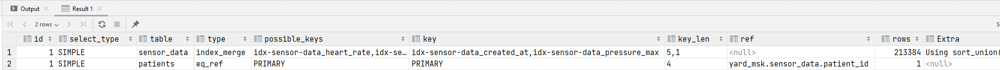

# Задание №1

**Условие:** 

Вы работаете над проектом умной больницы, где каждый из 1000 пациентов имеет специальный датчик, который раз в 10 минут передает сведения о пульсе и давлении подопечного.  

Напишите SQL таблицы для хранения этих данных, учитывая то, что один из самых частых запросов к ней будет: выбор всех подопечных у которых после обеда были превышены нормы пульса и давления.

**Решение:**

```sql

-- ==================================
-- Пациенты
-- ==================================

CREATE TABLE `patients` (
    `id` int(11) UNSIGNED NOT NULL PRIMARY KEY AUTO_INCREMENT,
    `first_name` varchar(128) NOT NULL COMMENT 'Имя пациента',
    `last_name` varchar(128) NOT NULL COMMENT 'Фамилия пациента'
) ENGINE=InnoDB COMMENT='Пациенты';

-- ==================================
-- Данные с датчика
-- ==================================

CREATE TABLE `sensor_data` (
    `id` bigint(20) UNSIGNED NOT NULL PRIMARY KEY AUTO_INCREMENT,
    `patient_id` int(11) UNSIGNED NOT NULL COMMENT 'ID пациента',
    `heart_rate` tinyint(3) NOT NULL COMMENT 'Пульс',
    `pressure_min` tinyint(3) NOT NULL COMMENT 'Нижняя граница давления',
    `pressure_max` tinyint(3) NOT NULL COMMENT 'Верхняя граница давления',
    `created_at` datetime NOT NULL DEFAULT CURRENT_TIMESTAMP COMMENT 'Дата и время измерения'
) ENGINE=InnoDB COMMENT='Данные сенсора';

-- ==================================
-- Внешний ключ и индексы
-- ==================================

ALTER TABLE `sensor_data`
    ADD CONSTRAINT `fk_patient` FOREIGN KEY (`patient_id`) REFERENCES `patients` (`id`) ON DELETE CASCADE ON UPDATE CASCADE;

ALTER TABLE `sensor_data`
    ADD KEY `idx-sensor-data_patient_id` (`patient_id`),
    ADD KEY `idx-sensor-data_created_at` (`created_at`);
```

##Миграции для Yii 2

Миграции находятся в папке [migration](https://gitlab.com/aik27/boxberry-test/task1/migration). Они же вставляют данные для теста: ~4.3 миллиона записей (показания для 1000 пациентов за 30 дней). 

Т.к. значения пульса и давления создаются функций `rand()`, то после обеда у всех пациентов будет превышение допустимых значений.

##Пример запроса на получение данных за конкретный день

Предположим, что доктор предоставил следующие границы допустимых значений:

+ Нижняя граница пульса: 50
+ Верхняя граница пульса: 100
+ Нижняя граница систолического артериального давления: 90
+ Верхняя граница систолического артериального давления: 140

```sql
SELECT
    patients.id,
    patients.first_name,
    patients.last_name,
    sensor_data.heart_rate,
    sensor_data.pressure_min,
    sensor_data.pressure_max,
    sensor_data.created_at
FROM
    `sensor_data`
        LEFT JOIN
    `patients` ON (patients.id = sensor_data.patient_id)
WHERE
    sensor_data.created_at >= "2021-10-26 14:00:00" AND
    (
        (sensor_data.heart_rate <= 50 OR sensor_data.heart_rate >= 100) OR
        (sensor_data.pressure_max <= 90 OR sensor_data.pressure_max >= 140)
    )
GROUP BY
    patients.id
ORDER BY
    sensor_data.heart_rate DESC,
    sensor_data.pressure_max DESC
```

Профилирование запроса на выборке 4 338 264 снятых показаний показало время **0,1227 сек.** при выборке за конкретный день. 

**Результат EXPLAIN:**



Ускорение получилось из-за индекса на дату. Остальные вариации индексов, в том числе составные не дали улучшения. Т.к. составление самого запроса не входило в задание, остановился на этом.


